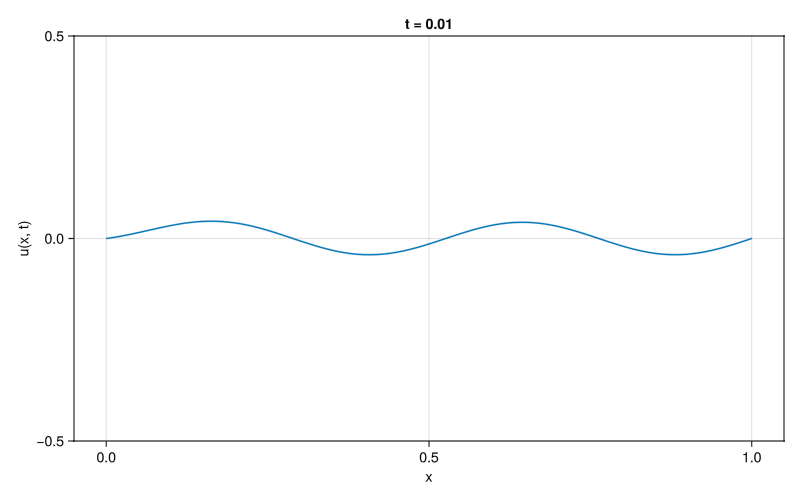
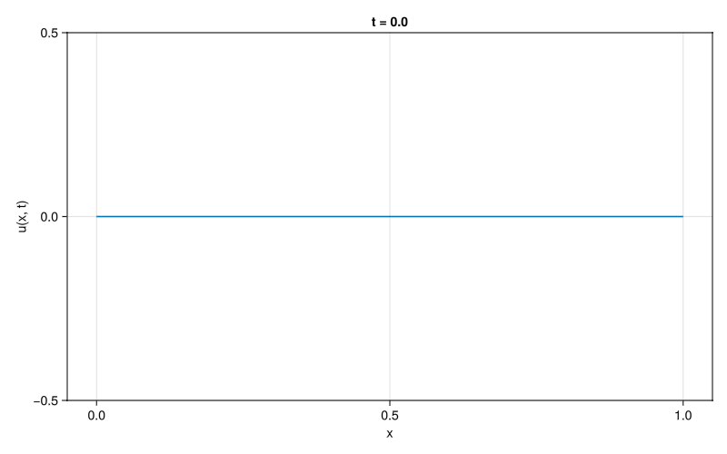

# TW3715TU 2025 Shallow Waters Project

This is a repository for the Computational Engineering 2025 TU Delft minor for group 8.

## Literature report

During the literature report, work was done to explore the methods and the ecosystem
of Julia. The output of this is in the `FD_and_HB.ipynb` file, which contains
a comparison of Harmonic Balance method, as well as a Finite Difference spatial
discretization with Implicit Euler timestepping for 1D case of wave equation
with cubic damping. Below are animations showing the final results. 
For more details refer to the notebook.

### Harmonic Balance solution 

### Finite Difference solution
